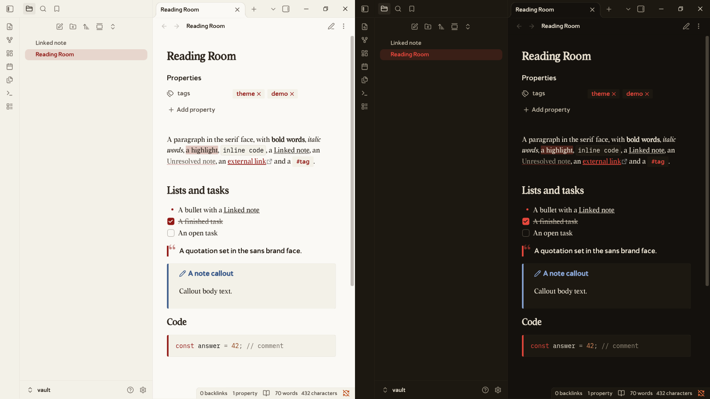
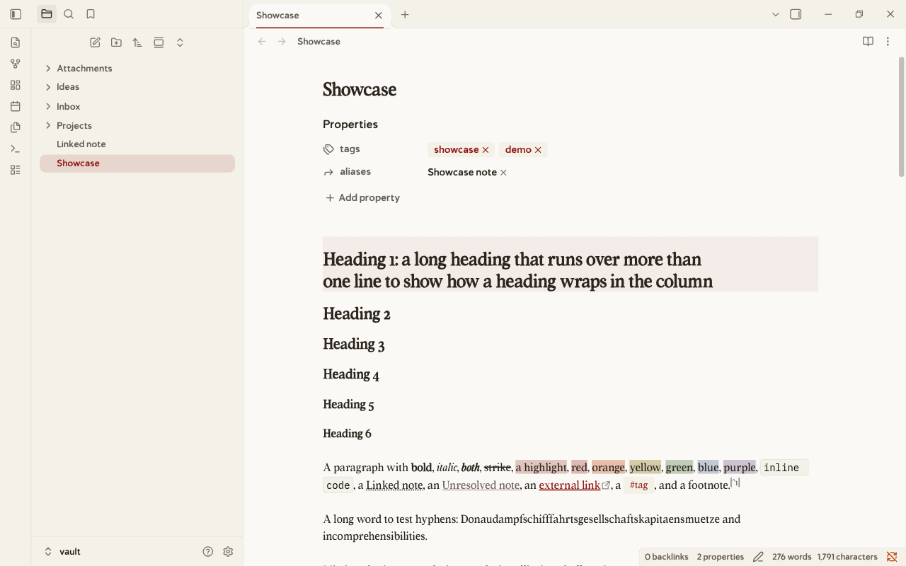
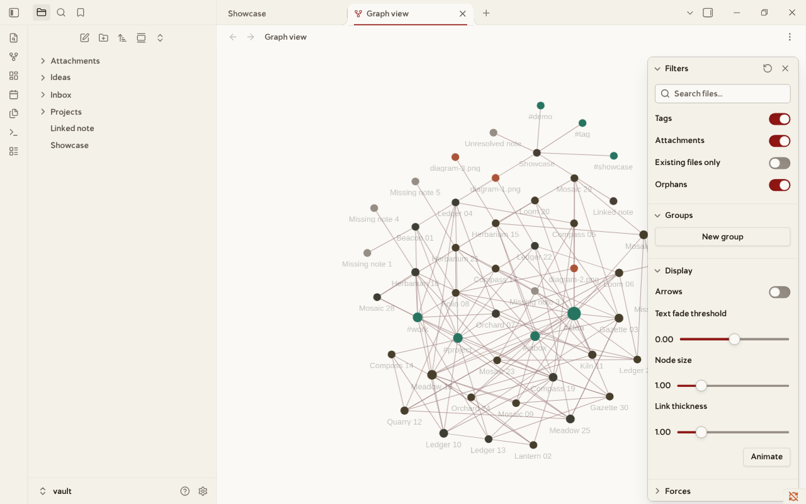
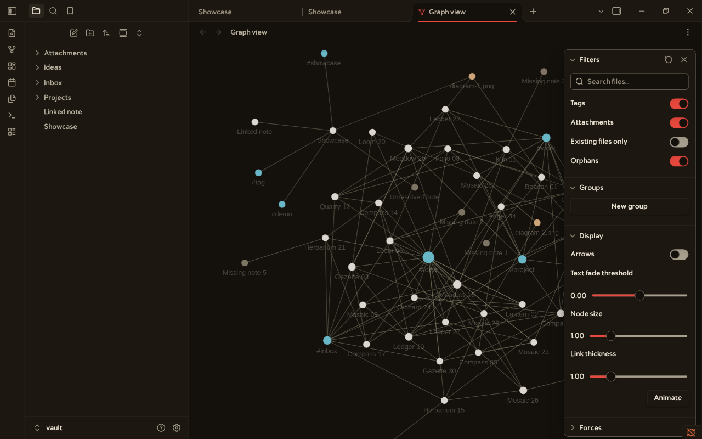
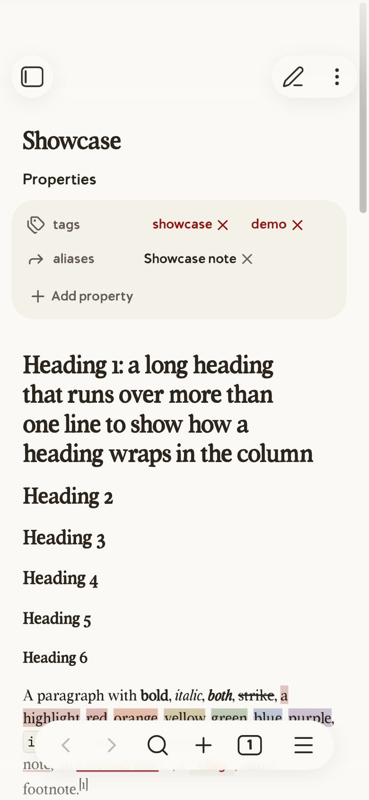
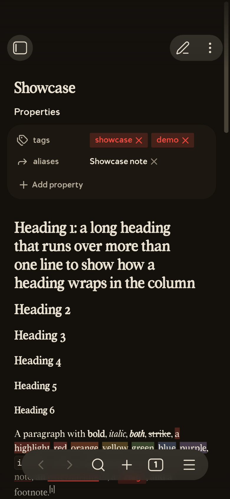
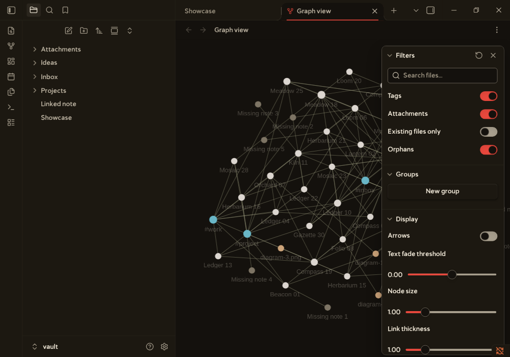

# Lexmechanic

Lexmechanic is a theme for Obsidian. It uses a warm paper ground, dark brown text, and a red ink accent.



The screenshot shows a note in reading view in Obsidian 1.14.4. Light mode is on the left. Dark mode is on the right.

More views, in Obsidian 1.14.4 on Linux with the demo vault. `python3 scripts/take_screenshots.py` makes them again.

| Live Preview, light | Graph view, light | Graph view, dark |
|---|---|---|
|  |  |  |

| Phone, light | Phone, dark | Settings, light |
|---|---|---|
|  |  |  |

The phone images come from the mobile emulation of Obsidian on a desktop, not from a phone.

## What it does

The theme sets the colors, fonts, and link styles for the editor and the interface. It has a light mode and a dark mode. The light mode follows the colors of fromjason.xyz. The dark mode is a new version of the same colors.

Two optional CSS snippets add more styles. You can turn each snippet on or off alone.

## Requirements

* Obsidian for desktop, with installer version 1.4.13 or newer.
* The theme uses `color-mix()`. This function needs Chromium 111 or newer.
* Installer 1.4.13 has Electron 25.8.1. The installer is a different download from the app updates, and you must update it by hand. Get the newest installer from https://obsidian.md/download.
* The theme is not tested with an older installer.

## Compatibility

| Obsidian app | Installer | System | Result |
|---|---|---|---|
| 1.14.4 | 1.13.7 | Linux | Tested: reading view and Live Preview in both modes, and the checks of `scripts/` |
| Any | Older than 1.4.13 | Any | Not supported. The theme needs `color-mix()`. |
| Any | 1.4.13 or newer | Windows, macOS | Not tested |
| Any | Any | Android, iOS | Not tested |

## Install

With the plugin BRAT, you can install only the theme: open the command palette, run `BRAT: Themes: Grab a beta theme for testing from a Github repository`, and enter `Orpheus-21/lexmechanic-theme`. BRAT downloads `theme.css` and `manifest.json` from the default branch. It does not install the snippets. I checked that both files can be downloaded from that address, and I did not run BRAT. Choose the theme in Settings, Appearance. For the snippets, use one of the steps below.

1. Download this repo, or run `git clone https://github.com/Orpheus-21/lexmechanic-theme.git`.
2. Find the folder of your vault. The vault has a hidden folder named `.obsidian`.
3. Copy the files into the vault. Choose one way:
   * On Linux and macOS, run `scripts/install.sh VAULT` in the repo folder. Replace `VAULT` with the path of your vault.
   * On Windows, run `.\scripts\install.ps1 -Vault "C:\path\to\vault"` in PowerShell. This script is not tested on Windows.
   * In a terminal, run these commands in the repo folder:

```
mkdir -p "VAULT/.obsidian/themes/Lexmechanic" "VAULT/.obsidian/snippets"
cp manifest.json theme.css "VAULT/.obsidian/themes/Lexmechanic/"
cp snippets/*.css "VAULT/.obsidian/snippets/"
```

   * In a file manager, make the folders `.obsidian/themes/Lexmechanic` and `.obsidian/snippets` in the vault if they do not exist. Copy `manifest.json` and `theme.css` into the first folder. Copy the files of `snippets/` into the second folder.
4. Open Obsidian. Open Settings, then Appearance.
5. Under Themes, choose `Lexmechanic`.
6. Under CSS snippets, turn on `lexmechanic-extras` and `lexmechanic-fun`. This step is optional.

The folder name `Lexmechanic` must match the `name` in `manifest.json`.

A file manager can hide the `.obsidian` folder. In Finder on macOS, press Command, Shift, and the period key. In Explorer on Windows, open View, then Show, then Hidden items. Most file managers on Linux show hidden items with Ctrl and H.

## Update

1. Get the new version: run `git pull` in the clone, or download the repo again.
2. Copy the files into the vault again, in the same way as the install. The new files replace the old ones.
3. Restart Obsidian.

The file `CHANGELOG.md` lists the changes of each version.

## Uninstall

1. Open Settings, then Appearance. Under Themes, choose another theme. Under CSS snippets, turn off `lexmechanic-extras` and `lexmechanic-fun`.
2. Delete the folder `.obsidian/themes/Lexmechanic` in the vault.
3. Delete the files `lexmechanic-extras.css` and `lexmechanic-fun.css` in the folder `.obsidian/snippets`.

## Usage

The theme works after you choose it. It follows the light or dark setting of Obsidian.

The theme has two snippets.

`lexmechanic-extras` styles these parts:

* Callouts get a panel color and a 4 pixel left border in the color of the callout type.
* Tables get a panel color on the header row.
* Tags get a rounded badge in the accent color. The snippet sets the tag variables of Obsidian.

`lexmechanic-fun` styles these parts:

* The text caret, the cursor, and the active line use the accent color.
* A horizontal rule shows as a short red dash.
* A block quote in reading view gets a large quote mark.
* A code block gets a red left border.
* Highlighted text (`==text==`) gets a red tint.
* Internal links have a dotted underline.

## Troubleshooting

* **The theme is not in the list.** The vault must have the files `.obsidian/themes/Lexmechanic/manifest.json` and `.obsidian/themes/Lexmechanic/theme.css`. The folder name must be `Lexmechanic`. Restart Obsidian.
* **The fonts fall back to a sans font.** Open Settings, Appearance, and look at Text font and Interface font. Obsidian uses a font that you set there before the font of the theme. Clear both fields and restart Obsidian. Obsidian Sync can copy these fields from another device, so check the phone too.
* **The snippets are not in the list.** The files must be in `.obsidian/snippets`, and their names must end in `.css`. Restart Obsidian.
* **Colors or borders look wrong.** The theme needs installer version 1.4.13 or newer. Look at the installer version in Settings, then General. The installer is a different download from the app updates.
* **The fonts differ from the screenshot.** Open Settings, then Appearance. If the font fields are not empty, they replace the fonts of the theme. Clear them.
* **A dash, an ellipsis, or a symbol is in another style.** The fonts of the theme have about 175 characters. Other characters use a fallback font. The file `docs/characters.md` lists them.
* **The labels in the graph view use a system font.** Obsidian fixes the font of the graph labels in its code. A theme cannot change it `docs/graph.md` tells how the graph gets its colors.
* **The theme looks wrong on a phone.** The theme is tested only in the mobile emulation of Obsidian on a desktop, not on Android or iOS.

## Presets

The folder `snippets/presets/` has optional snippets that you put on top of the theme. Copy one into the folder `.obsidian/snippets` of the vault, or run `scripts/install.sh VAULT --presets` to copy all of them. Then turn it on in Settings, Appearance, CSS snippets. Turn on only one preset of each kind.

| Preset | What it does |
|---|---|
| `lexmechanic-accent-blue`, `lexmechanic-accent-green`, `lexmechanic-accent-black` | Change the accent color in both modes. |
| `lexmechanic-oled` | A true black page in dark mode. |
| `lexmechanic-newsprint` | A lighter and cooler paper in light mode. |
| `lexmechanic-high-contrast` | A white or black page. Every text color reaches 7 to 1. |
| `lexmechanic-narrow`, `lexmechanic-wide` | The note column is 560 or 900 pixels wide. |
| `lexmechanic-sans-body`, `lexmechanic-mono-body` | The text of notes uses the sans or the monospace font. |
| `lexmechanic-hyphens` | Breaks long words in reading view. It needs a hyphenation dictionary, and Chromium on a desktop may not have one for your language. |
| `lexmechanic-graph-colorful` | A different color for each node type of the graph. |
| `lexmechanic-graph-monochrome` | Node types that differ by lightness only. |
| `lexmechanic-graph-high-contrast` | Stronger nodes, lines, and arrows in the graph. |
| `lexmechanic-graph-dim` | A quieter graph in dark mode. |
| `lexmechanic-tasks` | Icons and colors for the task states `[-]`, `[>]`, `[!]`, `[?]`, and `[/]`. |
| `lexmechanic-callouts-extra` | Two more callout types, `[!idea]` and `[!definition]`. |
| `lexmechanic-drop-cap` | A large first letter on the first paragraph of a note in reading view. |
| `lexmechanic-paper-texture` | A fine paper grain over the page. |
| `lexmechanic-typewriter` | Half a screen of space above and below the text of the editor. |
| `lexmechanic-focus` | Dims every line of the editor except the line of the cursor. |
| `lexmechanic-justified` | Justified paragraphs in reading view, with hyphens. |
| `lexmechanic-heading-numbers` | Numbers h2 to h4 as 1, 1.1, and 1.1.1 in reading view. |
| `lexmechanic-table-stripes`, `lexmechanic-table-hover`, `lexmechanic-table-numbers`, `lexmechanic-table-sticky` | Striped rows, a row tint on hover, digits of one width, and a header row that stays at the top. |
| `lexmechanic-quote-citation` | The last paragraph of a quote with two or more paragraphs is a citation. |
| `lexmechanic-hide-ribbon` | Hides the left ribbon. |
| `lexmechanic-slides` | Colors and fonts of the theme in the Slides core plugin. |
| `lexmechanic-graph-vignette` | A soft shade at the edges of the graph view. |
| `lexmechanic-graph-labels` | The labels of the graph use Volume Tc Sans. The file is large, because it holds the font data again. |

The scripts check the contrast and the graph colors of the presets. I looked at the presets of this table, except the accent colors, in Obsidian 1.14.4 on Linux, in light mode.

## Configuration

The plugin Style Settings shows the options of the theme in Settings, Style Settings, Lexmechanic. The options are the accent color and its hover color, the width of the note column, the three fonts, the six heading sizes, and the colors and opacity of the graph. The snippet `lexmechanic-fun` adds four switches: a plain horizontal rule, no pull quote mark, solid underlines for internal links, and a plain code block border. The theme works without the plugin. A color option changes the palette color only. The Obsidian variables `--accent-h`, `--accent-s`, and `--accent-l` keep their values. I tested the options in Style Settings 1.0.9 and Obsidian 1.14.4 by setting values through the plugin. I did not click through its window.

These Obsidian settings also change how the theme looks:

* Appearance, Text font, Interface font, and Monospace font replace the fonts of the theme.
* Editor, Readable line length turns the note column on or off. The column is 700 pixels wide. This is the default of Obsidian, and the theme does not change it.

## How it works

`theme.css` is built from the files in `src/`. Do not edit `theme.css` by hand. Edit a file in `src/`, run `./build.sh`, and commit both. Run `./build.sh --check` to test that `theme.css` is up to date. The command exits with 1 if it is not.

`theme.css` has these parts, in this order:

1. Three `@font-face` rules, in `src/10-fonts.css`. Each rule holds a font as a base64 data URI.
2. One block of variables for both modes, in `src/20-shared.css`. It sets the font variables `--font-text-theme`, `--font-interface-theme`, and `--font-monospace-theme`. It also sets the variables for block quotes, code borders, headings, and list markers. It sets the variables for scrollbars, selected items in the file list, the focus border, and form fields.
3. One block of variables for `.theme-light`, in `src/30-light.css`.
4. One block of variables for `.theme-dark`, in `src/40-dark.css`.
5. A rule that prints the light colors in dark mode, in `src/45-print.css`. `scripts/make_print.py` writes the file from `src/30-light.css`.
6. The rules that need a selector, in `src/50-rules.css`: the canvas color, the font of block quotes, the border of controls, the active tab, forced colors, print, reduced motion, and the graph.
7. The block of options for the Style Settings plugin, in `src/60-settings.css`.

Each mode block starts with the palette: the `--lex-*` variables. Change a color there, and every other line follows. The rest of the block sets the Obsidian variables for backgrounds, text, links, code, the graph view, and the status colors. It also sets the accent with `--accent-h`, `--accent-s`, and `--accent-l`. It sets the eight base colors and the ten `--code-*` variables for syntax colors.

The snippets use only these variables. They add no colors of their own.

## Checks

Run `make all` in the repo folder. It checks that `theme.css` is up to date, runs the unit tests, runs stylelint, and checks the contrast. It needs Python 3 and `npx`.

The script `scripts/check_contrast.py` checks the contrast of the colors. Text colors must reach 4.5 to 1 on the page, panel, and alt panel colors. Interface colors, such as the focus ring, must reach 3 to 1. The script exits with 1 when a pair is too low.

Some pairs are below their minimum, and the author keeps them: three dark mode pairs of the accent on the alt panel color, and the border of controls. The script lists them as known and does not fail for them.

The file `docs/contrast.md` has the contrast of every color pair, and of the graph colors. Five more checks need Chromium and an installed Obsidian: `check_variables.py`, `check_resolve.py`, `check_baseline.py`, `check_graph.py`, and `check_screenshots.py`. The file `CONTRIBUTING.md` describes them.

## Contributing

The source is in `src/`. Run `./build.sh` after a change, and `make all` to check it. The file `CONTRIBUTING.md` has the details.

## Fonts

The fonts Volume Tc and Volume Tc Sans belong to Tom Chalky. The font files say "Copyright (c) 2022 by Tom Chalky. All rights reserved." The license terms are at https://tomchalky.com/extended-licensing. The GPL does not cover these fonts.

## Credits

* The light mode colors come from the CSS of https://www.fromjason.xyz. The dark mode colors are new.
* The fonts Volume Tc and Volume Tc Sans are by Tom Chalky: https://tomchalky.com.

## License

The CSS and the manifest of this repo use the GNU General Public License, version 3 or any later version. The `LICENSE` file has the text. The license does not cover the embedded fonts. See the Fonts section.
